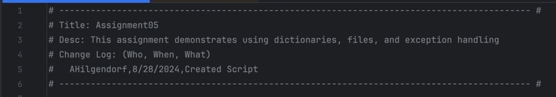
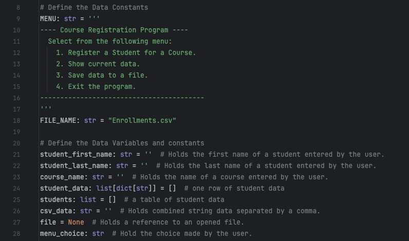

Andrea Hilgendorf

August 28, 2024

IT FDN 110 B

Assignment 05

Advanced Collections and Error Handling

# Introduction

During this week's module, I became familiar with the use of
dictionaries, JSON files, error handling, and GitHub. Using a dictionary
along with a JSON file allows better data organization and access. I
also created a GitHub account and repository for this course (link). A
very useful idea to learn this week was that of error handling. It is,
in fact, intimidating to encounter errors while executing code, however,
gathering the kind of error as well as preventing it and handling allows
for a better experience.

# Steps

1.  File naming convention: to comply with the assignment criteria, I
    named my Python file "assignment05.py".

{width="4.13961176727909in"
height="1.1188123359580053in"}

Figure 1: File Name

2.  {width="6.721527777777778in"
    height="1.1777777777777778in"}Script Header: I typed a header for my
    script, which I included the necessary '#' and '-' symbols, plus an
    appropriate title and description, and a change log to include my
    name as the author, today's date, and the type of work I did in this
    file.

3.  Defining constants and variables: I followed the instructions to set
    up two constants and several variables for the program. Each
    constant is accompanied by its data type and then set up with a
    value or as an empty string, a dictionary, or an empty list.

4.  {width="5.415277777777778in"
    height="3.1902777777777778in"}Reading Data from an Existing file: to
    comply with the processing requirement of *"When the program starts,
    the contents of the \"Enrollments.csv\" are automatically read into
    a two-dimensional list table (a list of list rows)."* I made sure
    that:

    a.  There existed a filed called *Enrollments.csv* and that it
        contained some data:

> {width="5.125in"
> height="1.5416666666666667in"}
>
> Figure 4: existing csv file

b.  So that, when the program starts, the contents of the
    Enrollments.csv file are read into a two-dimensional list. Moreover,
    there is structured error handling for when the file is read (next
    page). In this block, I foresaw two possible errors: a) that the
    file didn't exist, in which case the code will create the file for
    the user, and b) that for any reason, the user can't access the
    indicated file, in which case the program will create a new file.
    Lastly, I used a catch-all exception for any errors I couldn't
    foresee.

> {width="5.633662510936133in"
> height="5.329547244094488in"}
>
> Figure 5: Opening the file and reading it with error handling

5.  Displaying the Menu and processing the user's input: The program
    then enters a loop that displays the menu and handles the user\'s
    choices. I used a while True loop to keep the program running until
    the user decides to exit. The user\'s choice is stored in the
    menu_choice variable. At this stage, the program asks the user for
    input, while also controlling for user input and redirecting the
    user to enter only allowed characters. At this stage, the program
    also notifies the user once a student is registered.

    a.  Choice 1: In this choice, the program takes the user\'s input
        for a student\'s first, last name, and course name and controls
        for data type when the user inputs anything other than allowed
        alphabetic characters for first and last name. **Note:** I also
        used a. isalnum() method as an addition to handle errors in the
        course_name variable (next page).

{width="7.635671478565179in"
height="4.831683070866141in"}

Figure 6: User input with error handling

b.  Choice 2 presents **all** data that has been entered so far and
    complies with test criteria *"The program allows users to
    [display]{.underline} multiple registrations (first name, last name,
    course name)"*

{width="6.603886701662292in"
height="1.7524759405074366in"}

Figure 7: Presenting current data

c.  Choice 3: This condition meets the test criteria "the program opens
    a file named \"Enrollments.csv\" in write mode using the open()
    function. It writes the content of the csv_data variable to the file
    using the write() function, then file is closed using the close()
    method. Then displays what was stored in the file." It also includes
    a catch-all error handling with a message indicating that an
    "Unexpected error occurred" and an explanation for the error. In
    this step, I also ensured the file is closed after saving the data.

{width="6.545593832020997in"
height="3.356434820647419in"}

Figure 8: Saving data to the file

d.  Stopping the loop with choice 4 and handling errors:

> {width="6.556002843394576in"
> height="2.009900481189851in"}
>
> Figure 9: closing the loop and ending the program

e.  When the loop has ended, the program shows that the program has come
    to an end.

# Summary

This assignment demonstrated my understanding of lists, loops, storing
data and handling errors as well as using GitHub as a way for source
control. I was able to practice naming a file, writing a header,
defining constants and variables, adding comments to my script, opening
and closing files, presenting and processing data, saving the data to a
list, and then to a file -- All while thinking about error handling.
Additionally, I was able to run my code both in PyCharm and in my Mac's
terminal.

After running my program, the Enrollments.csv file contains an
additional students entered in the last iteration of my program.

{width="3.0254932195975504in"
height="9.415840988626421in"}

Figure 10: Running the program in PyCharm

{width="4.472222222222222in"
height="2.3333333333333335in"}

Figure 11: Testing the program

The program also runs in the Terminal:

{width="3.4749967191601048in"
height="5.366336395450569in"}

Figure 12: Running my code in the Terminal

Reading the modified csv file in the terminal (next page):

{width="4.638888888888889in"
height="1.4027777777777777in"}

# GitHub Repository

-   [Link to my GitHub profile](https://github.com/andreahilgendorf)

-   [Link to my
    Mod05](https://github.com/andreahilgendorf/IntroToProg-Python/tree/main/mod05_advanced_collections_and_error_handling):
    Collections and Error Handling

-   [Link to my assignment04.py
    code](https://github.com/andreahilgendorf/IntroToProg-Python/blob/main/mod05_advanced_collections_and_error_handling/assignment05.py)

[**Please note -** I decided to organize my repository by module --
hence, a small deviation from the instruction for this
assignment.]{.mark}
