Andrea Hilgendorf September 4th, 2024 IT FDN 110 B Assignment 06 

Functions, Classes, and Separation of Concerns 

Programming Pattern

Introduction 

During this week’s module, I learned about the use of functions, classes, and the use of separation of concerns. For this assignment, I built up on the prior assignments but added the three concepts mentioned before.  

Steps 

1. File naming convention: to comply with the assignment criteria, I named my Python file “assignment06.py”. 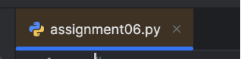

   *Figure 1: File Name* 

2. Script Header:  I typed a header for my script, which I included the necessary ‘#’ and ‘-’ symbols, plus an appropriate title and description, and a change log to include my name as the author, today’s date, and the type of work I did in this file.

   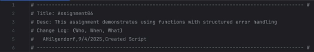

   *Figure 2: Script Header* 

3. Using an import statement to access a library to use the JSON functionalities.  

   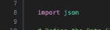

   *Figure 3: import statement* 

4. Defining constants and variables: I followed the instructions to set up two constants (MENU and FILE\_NAME) and two variables (menu\_choice and students) for the program. Each constant and variable is accompanied by its data type and then set up with a value or as an empty string or an empty list. 

   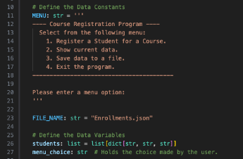

   *Figure 4: Constants and Variables* 

5. Classes: I included two classes, FileProcessor and IO. Each includes a descriptive documenting string: 

   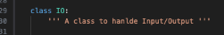

   *Figure 5: class with descriptive string* 

   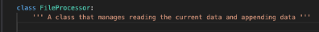

   *Figure 6: class with descriptive string* 

6. Functions: I defined seven di erent methods each with a descriptive string, calling out the @staticmethod decorator, and including the output\_error\_messages for error handling for those with except blocks. 
1. Method 1: IO.output\_error\_messages(message: str, error: Exception = None) 

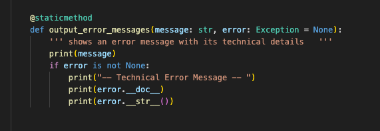

*Figure 7: Method 1 with descriptive string – within IO class* 

2. Method 2: output\_menu(menu: str) 

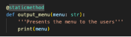

*Figure 8: Method 2 with descriptive string within IO Class* 

3. Method 3: IO.input\_menu\_choice(): 

   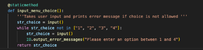

   *Figure 9: Method 3 with descriptive string within IO class* 

4. Method 4: IO.output\_student\_courses(student\_data: list) 

   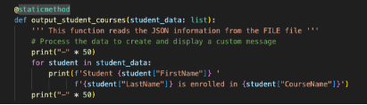

   *Figure 10: Method 4 with descriptive string within IO Class* 

5. Method 5: IO.input\_student\_data(student\_data: list) 

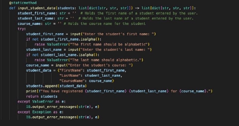

*Figure 11: Method 5 with descriptive string within IO Class* 

6. Method 6: read\_data\_from\_file(file\_name: str, student\_data: list):

   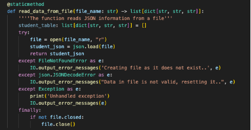

   *Figure 12: Method 6 with descriptive string within the FileProcessor Class* 

7. Method 7: write\_data\_to\_file (file\_name: str, student\_data: list):

   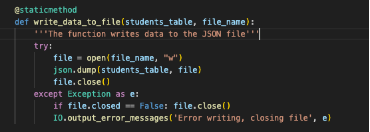

   *Figure 13: Method 7 with descriptive string within the FileProcessor Class*

7. Processing data and collecting Input/Output: Each of the menu choices are presented to the user and the user’s input is collected: 

   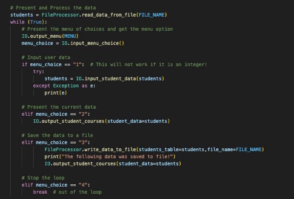

   *Figure 14: The program outputs a menu choice and collected user's input*

Summary 

This assignment demonstrated my understanding of methods and classes, as well as using GitHub as a way for source control. I was able to practice using a JSON file, writing a header, defining constants and variables, adding comments to my script, opening and closing files, presenting and processing data, saving the data to a list, and then to a file – All while thinking about error handling. Additionally, I was able to run my code both in PyCharm and in my Mac’s terminal. 

After running my program, the Enrollments.json file contains an additional students entered in the last iteration of my program. 

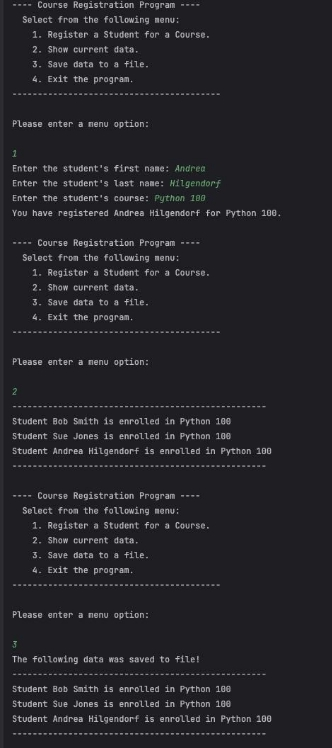 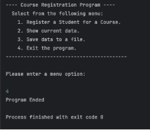

*Figures 15 & 16: Running the program in PyCharm* 

The program also runs in the Terminal:  

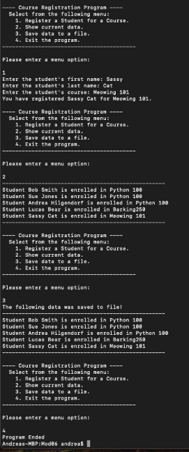

*Figure 16: Running my code in the Terminal* 

Reading the modified .json file: 

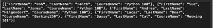

GitHub Repository 

- [Link to my GitHub profile ](https://github.com/andreahilgendorf)
- [Link to my Mod06:](https://github.com/andreahilgendorf/IntroToProg-Python/tree/main/mod06_functions) Functions 
- [Link to my assignment06.py code  ](https://github.com/andreahilgendorf/IntroToProg-Python/blob/main/mod06_functions/assignment06.py)

**Please note -** I decided to organize my repository by module – hence, a small deviation from the instruction for this assignment.
