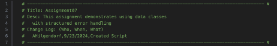

Andrea Hilgendorf September 24th, 2024 IT FDN 110 B Assignment 07 

Classes and Objects

Introduction 

In module 07 I learned about the di erences between statements, functions, and classes. These three elements are the basic component of a program. I worked with classes, constructors, attributes, and properties. I also learned about the di erence between data classes, presentation classes, and processing classes. Finally,  I also learned about Git uses and functions like the .GitIgnore and sharing my projects in GitHub with commit and push.  

Steps 

1. File naming convention: to comply with the assignment criteria, I named my Python file “assignment07.py”. 

   

   *Figure 1: File Name* 

2. Script Header:  I typed a header for my script, which I included the necessary ‘#’ and ‘-’ symbols, plus an appropriate title and description, and a change log to include my name as the author, today’s date, and the type of work I did in this file. 

   

   *Figure 2: Script Header* 

3. Using an import statement to access a library to use the JSON functionalities.  

   

   *Figure 3: import statement* 

4. Defining constants and variables: I followed the instructions to set up two constants (MENU and FILE\_NAME) and two variables (menu\_choice and students) for the program. Each constant and variable is accompanied by its data type and then set up with a value or as an empty string or an empty list. There are additional variables declared as needed.  

   

   *Figure 4: Constants and Variables* 

5. Classes: I included four classes, FileProcessor, IO, Person, and Student. Each includes a descriptive documenting string: 

   

   *Figure 5: class with descriptive string* 

   

   *Figure 6: class with descriptive string* 

   

   *Figure 7: class with descriptive string* 

   

   *Figure 8: class with descriptive string* 

6. Class Properties: my program includes three properties for the student first name, student last name, and the course name.s 

   

   *Figure 9: Class properties with validation code set to empty strings* 

   

   *Figure 10: Class property with simple validation code set to an empty string* 

7. Class Methods: my program includes two string methods for extracting data from the Person and Student classes: 

   

   *Figure 11: class method to extract data from the class Person* 

   

   *Figure 12: class method to extract data from the class Student* 

8. Functions: I defined eight di erent functions each with a descriptive string, except blocks that call out the error handling message. All eight functions use the @staticmethod decorator. 
1. Method 1: output\_error\_messages(message: str, error: Exception = None) 

   

   *Figure 13: Method 1 with descriptive string – within IO class* 

2. Method 2: output\_menu(menu: str) 

   

   *Figure 14: Method 2 with descriptive string – within IO Class* 

3. Method 3: input\_menu\_choice(): 

   

*Figure 15: Method 3 with descriptive string – within IO class* 

4. Method 4: output\_student\_courses(student\_data: list) 

   

   *Figure 16: Method 4 with descriptive string –  within IO Class* 

5. Method 5: input\_student\_data(student\_data: list)

   

*Figure 17: Method 5 with descriptive string – within IO Class* 

6. Method 6: read\_data\_from\_file(file\_name: str, student\_data: list):

   

   *Figure 18: Method 6 with descriptive string – within the FileProcessor Class* 

7. Method 7: write\_data\_to\_file (file\_name: str, student\_data: list):

   

   *Figure 19: Method 7 with descriptive string – within the FileProcessor Class* 

9. Processing data and collecting Input/Output: Each of the menu choices are presented to the user and the user’s input is collected. On menu choice 1, the user can enter student data. On menu choice 2, the user can see the collected data. On menu choice 3, the program writes data to the .json file. Lastly, menu choice 4 breaks the loop and the program ends:  

*Figure 20: Program’s input/output and processing of data.*  

10. Error handling is included for handling errors while reading the file, for user’s input, and for problems while trying to read the .json file. 

    

    *Figure 21: error handling* 

    

    *Figure 22: error handling* 

Summary 

This assignment demonstrated my understanding of methods and classes, as well as using GitHub as a way for source control. I was able to practice using a JSON file, writing a header, defining constants and variables, adding comments to my script, opening and closing files, presenting and processing data, saving the data to a list, and then to a file – All while thinking about error handling. Additionally, I was able to run my code both in PyCharm and in my Mac’s terminal. Additionally, I got to build upon my knowledge of Python with the insertion of classes and methods for this module.  

While running my program, I was able to test and see that the program takes in three forms of user input (student’s first and last name, and a course name). The program is also capable of displaying the user’s input collected and saving it to the .json file. The user can enter multiple students to the program and similarly, the program can display multiple registrations and save them to the file.  

The program runs in the Terminal:  

*Figure23: Running my code in the Terminal* 

GitHub Repository 

- [Link to my GitHub profile ](https://github.com/andreahilgendorf)
- [Link to my repository which includes Mod07 ](https://github.com/andreahilgendorf/IntroToProg-Python/tree/main/mod06_functions)

**Please note -** I decided to organize my repository by module – hence, a small deviation from the instruction for this assignment.
